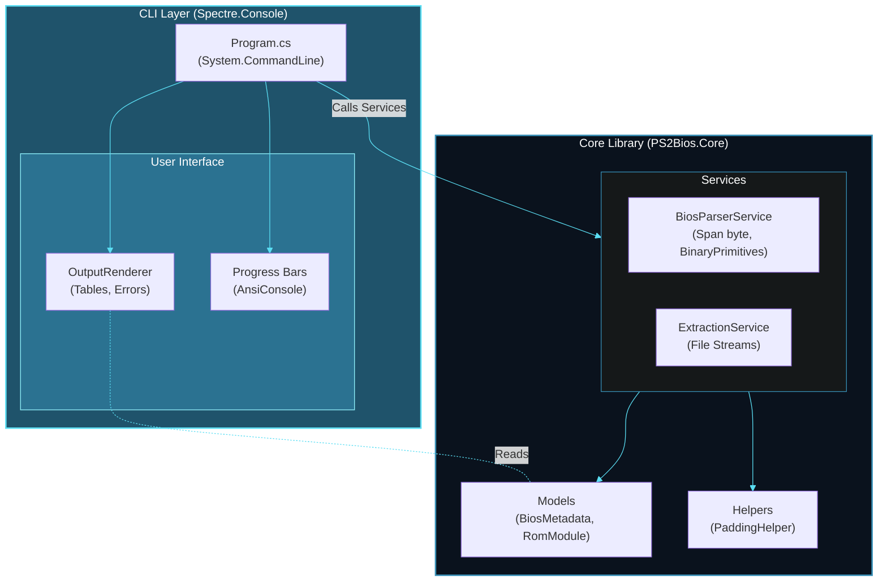

<div align="center">
  
</div>

<h1 align="center">PS2BIOS.Toolkit</h1>
<p align="center">Parse and Extract PS2 BIOS Modules.</p>

## Architecture



## Workflow

### Parsing Process


## Technologies

* **.NET 9** - Latest stable runtime.
* **Spectre.Console 0.49** - Beautiful console output, tables, and progress bars.
* **System.CommandLine** - Robust command-line argument parsing.
* **Span<byte>** - High-performance memory manipulation for binary parsing.
* **XUnit & FluentAssertions** - Comprehensive unit testing.

## How to Use

### CLI Usage

You can use the tool directly from the command line to inspect or extract modules.

```bash
# Extract all modules from a BIOS dump
dotnet run -- project src/CLI --file "scph10000.bin" --all

# Extract a single module by index
dotnet run -- project src/CLI --file "scph10000.bin" --index 4

```

### Library API (Core)

You can use the `PS2Bios.Core` library in your own projects for direct access to BIOS data.

```csharp
using PS2Bios.Core.Services;
using PS2Bios.Core.Interfaces;

// Initialize services
IBiosParser parser = new BiosParserService();
IExtractionService extractor = new ExtractionService();

// 1. Parse the file
using var stream = File.OpenRead("bios.bin");
var metadata = await parser.ParseAsync(stream, "bios.bin");

// 2. Inspect modules
foreach (var module in metadata.Modules)
{
    Console.WriteLine($"Module: {module.Name} | Size: {module.HexSize}");
}

// 3. Extract specific module
await extractor.ExtractAsync(stream, metadata.Modules[0], "./output_folder");
```

## Benefits

1. **Efficiency**: Utilizes `ReadOnlySpan<byte>` and `BinaryPrimitives` for fast parsing without unnecessary allocations.
2. **User Experience**: Provides formatted tables and extraction progress bars via `Spectre.Console`.
3. **Accuracy**: Correctly handles 16-byte alignment and padding required by the PS2 BIOS format.
4. **Modular**: The parsing logic is completely separated from the UI, allowing reuse in GUI applications.
5. **Modern**: Built on pure .NET 9 with asynchronous file I/O operations.

## Next Steps

* [ ] Implement compressed module handling.
* [ ] Improved validation for incomplete dumps.